# How pCORE Works

## 1. Deposit Process


1. **Deposit CORE**: Users deposit CORE or WCORE tokens into the Corepilot protocol
2. **Automatic Distribution**: The protocol distributes CORE to optimal validators
3. **Receive pCORE**: Users receive pCORE tokens representing their stake
4. **Earn Rewards**: Rewards accrue to the protocol, increasing pCORE value

#### Example

- User has 150 WCORE
- Current exchange rate is 1.5
- Deposit 150 WCORE, user will receive 100 pCORE (150 / 1.5)

## 2. Exchange Rate Mechanism

The pCORE to CORE exchange rate increases over time as staking rewards are earned:

```
Exchange Rate = (Total CORE Staked + Accumulated Rewards) / Total pCORE Supply
```

### Example

- **Initial State**: 1,000 CORE staked → 1,000 pCORE minted → Exchange Rate = 1.00
- **After Rewards**: 1,500 CORE (1,000 + 500 rewards) → 1,000 pCORE → Exchange Rate = 1.5
- **User Benefit**: Each pCORE token is now worth 1.5 CORE

### Value Appreciation Workflow

```mermaid
flowchart TB
    A["💰 Initial Deposit<br/><b>1,000 CORE</b>"]
    B["🪙 Tokens Minted<br/><b>1,000 pCORE</b>"]
    C["📊 Exchange Rate<br/><b>1.00</b>"]

    D["⚡ Validators Work<br/><b>Generate Rewards</b>"]

    E["📈 Assets Grow<br/><b>1,050 CORE</b>"]
    F["🪙 Supply Unchanged<br/><b>1,000 pCORE</b>"]

    G["📊 New Exchange Rate<br/><b>1.05</b>"]
    H["🎉 User Benefits<br/><b>+5% Value</b>"]

    A --> B
    B --> C
    C --> D
    D --> E
    D --> F
    E --> G
    F --> G
    G --> H

    style A fill:#e3f2fd,stroke:#1976d2,stroke-width:3px,color:#000
    style B fill:#e8f5e8,stroke:#388e3c,stroke-width:3px,color:#000
    style C fill:#fff3e0,stroke:#f57c00,stroke-width:3px,color:#000
    style D fill:#f3e5f5,stroke:#7b1fa2,stroke-width:3px,color:#000
    style E fill:#e8f5e8,stroke:#388e3c,stroke-width:3px,color:#000
    style F fill:#fff3e0,stroke:#f57c00,stroke-width:3px,color:#000
    style G fill:#c8e6c9,stroke:#2e7d32,stroke-width:4px,color:#000
    style H fill:#ffecb3,stroke:#ff8f00,stroke-width:4px,color:#000
```

<div align="center">



</div>

## 3. Redeem Process

Users can always redeem their pCORE tokens for CORE at the current exchange rate. Example: If the current exchange rate is 1.5, redeeming 100 pCORE will return 150 CORE. There are 2 redemption modes: **normal redeem** and **instant redeem**

### 3.1. Normal Redeem

- **Request redeem**: Submit a withdrawal request by burning pCORE tokens
- **Waiting Period**: 24-hour delay before CORE tokens can be claimed
- **Claim Tokens**: After waiting period, claim your CORE tokens at the locked exchange rate

#### Example

- User has 100 pCORE
- Current exchange rate is 1.5 when request is made
- **Step 1**: Request withdrawal → pCORE burned
- **Step 2**: Wait 24 hours for processing
- **Step 3**: Claim 150 CORE (100 × 1.5)

### 3.2. Instant Redeem (No unlock period)

Instant redemption lets users withdraw CORE immediately to their wallet without any redemption period (with a 10% fee).

#### Example

- User has 100 pCORE
- Current exchange rate is 1.5 when request is made
- Total: 150 CORE (100 × 1.5), user will immediately receive 135 CORE (150 x 0.9)

## 4. Deposit/Redeem Restrictions & Dues Protection

The Core staking contract enforces these rules:

- When delegating CORE, the amount must be >= 1 CORE.
- When undelegating CORE:
  - The amount must be >= 1 CORE, and
  - The remaining CORE left on a validator of this address must be >= 1 or = 0.

Since these restrictions also apply to pCORE, it must adhere to the same rules when executing all deposit, mint, redeem, withdraw operations.

## 5. Validator Selection & Optimization

- **Performance Monitoring**: Continuous tracking of validator performance metrics
- **APY Optimization**: Automatic rebalancing to maximize returns
- **Risk Assessment**: Evaluation of validator reliability and history

## 6. Reward Accumulation

- **Real-time Accrual**: Rewards are continuously added to the vault
- **No Manual Action**: Users don't need to claim or restake rewards
- **Compound Growth**: Rewards earn additional rewards over time

## 7. Share Calculation

- **Shares Received**: `deposit_amount × total_shares / total_assets`
- **Assets Received**: `shares_burned × total_assets / total_shares`
- **Preview Functions**: Users can preview exact amounts before transactions
